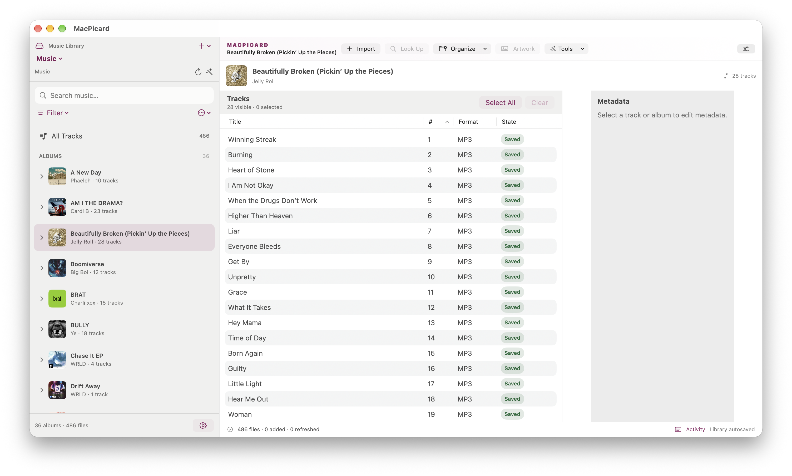

# MacPicard

## A calmer way to clean up your music library

MacPicard is a native macOS app for identifying, editing, and organizing music files with MusicBrainz.

Review matches before applying them, stage metadata and artwork changes safely, preview file moves, and save only when the result looks right. Your original files stay untouched during import, and important actions remain explicit and reversible.



### What it does

- Identify albums and tracks with MusicBrainz release matching.
- Review proposed tags, track assignments, and artwork before applying changes.
- Edit metadata and artwork for individual tracks, albums, or full libraries.
- Run Picard-style scripts and organize files with collision-safe previews.
- Import music into managed libraries without changing the source files.
- Play supported audio, search and filter collections, and manage multiple libraries.
- Recover from interrupted work with autosave, activity history, and external-change checks.
- Customize the toolbar, table columns, sidebar, and inspector; UI choices persist.

Supported formats include MP3, FLAC, M4A/MP4, Ogg Vorbis, Ogg Opus, and WAV.

> MacPicard is independent and not affiliated with MusicBrainz or the Picard project.

## Quick start

1. Open **File → New Music Library…** or **File → Open Music Folder…**.
2. Import or drop in music.
3. Select an album and choose **Look Up**.
4. Review the match, stage changes, and save when ready.

Normal fingerprint scanning requires no Homebrew, FFmpeg, Chromaprint install, or API key. Online identification requires an internet connection. Optional AcoustID submissions require explicit consent and authentication.

## Safety first

MacPicard separates identification, staging, saving, and organization:

- Imports copy files and leave source files unchanged.
- MusicBrainz matches never silently overwrite local metadata.
- Organization shows every source and destination path before moving anything.
- Existing destinations are never overwritten.
- Pending edits can be discarded without undoing tags already saved to disk.

## Build from source

MacPicard uses Swift 6, SwiftUI, and native macOS APIs. It requires macOS 26 and Xcode 26 or newer.

```sh
swift build
swift test
```

For Xcode, open `MacPicard.xcodeproj`, select the **MacPicard App** scheme, and run on **My Mac**.

## Learn more

- [Collection Tools and workflows](docs/WORKFLOWS.md)
- [Artwork management](docs/ARTWORK.md)
- [Fingerprinting](docs/FINGERPRINTING.md)
- [Design notes](docs/DESIGN.md)
- [Release checklist](docs/RELEASE_CHECKLIST.md)
- [Update system](docs/UPDATES.md)
- [Improvement roadmap](docs/IMPROVEMENT_PLAN.md)

## License and project status

MacPicard is an active project from [Interlaced Pixel](https://github.com/Interlaced-Pixel). See the repository and source files for current implementation status.
